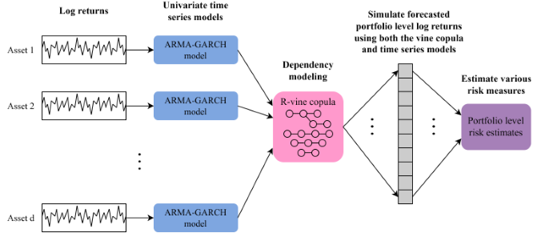
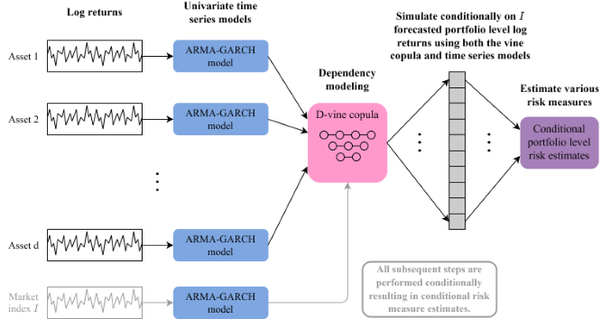

<!-- README.md is generated from README.Rmd. Please edit that file -->

```{r, include = FALSE}
knitr::opts_chunk$set(
  collapse = TRUE,
  comment = "#>",
  fig.path = "man/figures/README-",
  out.width = "100%"
)
```

# portvine <a href='https://github.com/EmanuelSommer/portvine'></a>

<!-- badges: start -->
[](https://cran.r-project.org/package=portvine)
[](https://cran.r-project.org/package=portvine)
[](https://app.codecov.io/gh/EmanuelSommer/portvine)
[](https://github.com/EmanuelSommer/portvine/actions)
[](https://lifecycle.r-lib.org/articles/stages.html#stable)
<!-- badges: end -->

Portfolio level unconditional as well as conditional risk measure estimation for backtesting and stress testing using Vine Copula and ARMA-GARCH models. The package implements the proposed approaches in [Sommer (2022)](https://mediatum.ub.tum.de/1658240).


## Installation

You can install the released version of `portvine` from [CRAN](https://cran.r-project.org/package=portvine) with:

```{r, eval=FALSE}
install.packages("portvine")
```


You can install the development version of `portvine` from [GitHub](https://github.com/) with:

``` r
# install.packages("devtools")
devtools::install_github("EmanuelSommer/portvine")
```
## What it does and why 

The implemented algorithms for the unconditional as well as conditional portfolio level risk measure estimation are based on my masters thesis at the chair of Mathematical Statistics at the TUM which you can find [here](https://mediatum.ub.tum.de/1658240). The general idea of the unconditional risk measure estimation approach is summarized in the flowchart below for a $d$-dimensional portfolio.

<br>

<br>
<br>

For the single conditional approach the general idea for a $d$-dimensional portfolio and a market index $I$ is summarized in the flowchart below.

<br>

<br>
<br>

If you want to get your hands dirty fast the **Get Started vignette** is a perfect fit for you as it showcases a minimal case study with a lot of code examples and some handy visualization functions that were not incorporated into the package as they are highly opinionated. 

In order to grasp what is going on under the hood a look at the **Under the hood article** on the package website is advised before starting to use the package. There the most important algorithms used during the risk measure estimation are explained. If this doesn't saturate your hunger for the theory behind the package you should take a look at [Sommer (2022)](https://mediatum.ub.tum.de/1658240).

Moreover the help pages are quite detailed so feel free to have a look at them.

## Parallel processing

The risk estimation algorithms implemented in this package lend themselves perfectly for parallel processing. In this package this is enabled through the in my humble opinion amazing [`future`](https://www.futureverse.org/) framework. For details please have a look at the detailed section on parallel processing within the help page of the `estimate_risk_roll()` function (or function reference on the package website). Some performance measurements of different parallel strategies and further information on the implemented parallelisms are presented in the **Parallel processing** article on the package website.

## Acknowledgements

This package is built on the shoulder of giants most importantly the R packages [`rvinecopulib`](https://CRAN.R-project.org/package=rvinecopulib) and [`rugarch`](https://CRAN.R-project.org/package=rugarch). Thus a big thanks goes to all the contributors and maintainers! Also I would like to thank my supervisors Prof. Claudia Czado and M.Sc. Karoline Bax for giving me the opportunity to work on this project and their very dedicated supervision!
