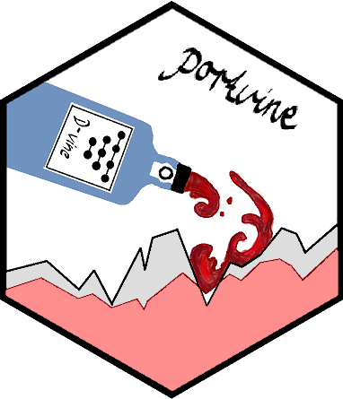

<!-- README.md is generated from README.Rmd. Please edit that file -->

```{r, include = FALSE}
knitr::opts_chunk$set(
  collapse = TRUE,
  comment = "#>",
  fig.path = "man/figures/README-",
  out.width = "100%"
)
```

# portvine <a href='https://github.com/EmanuelSommer/portvine'></a>

<!-- badges: start -->
<!-- badges: end -->

Portfolio level unconditional as well as conditional risk measure estimation for backtesting using vine copula and ARMA-GARCH models.

## Installation

You can install the development version of portvine from [GitHub](https://github.com/) with:

``` r
# install.packages("devtools")
devtools::install_github("EmanuelSommer/portvine")
```

Basic examples and references TBD here
