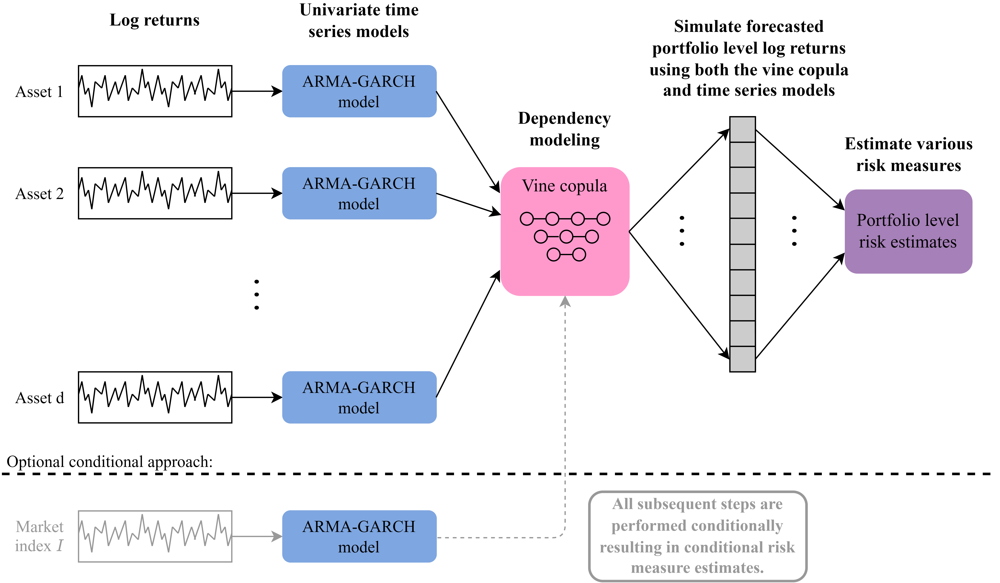

<!-- README.md is generated from README.Rmd. Please edit that file -->

# portvine <a href='https://github.com/EmanuelSommer/portvine'></a>

<!-- badges: start -->

[](https://github.com/EmanuelSommer/portvine/actions)
[](https://codecov.io/gh/EmanuelSommer/portvine)
[](https://www.tidyverse.org/lifecycle/#stable)
<!-- badges: end -->

Portfolio level unconditional as well as conditional risk measure
estimation for backtesting using vine copula and ARMA-GARCH models.

## Installation

You can install the development version of portvine from
[GitHub](https://github.com/) with:

``` r
# install.packages("devtools")
devtools::install_github("EmanuelSommer/portvine")
```

## What it does and why

The implemented algorithms for the unconditional as well as conditional
portfolio level risk measure estimation are based on my masters thesis
at the chair of Mathematical Statistics at the TUM which I will link to
here as soon as it is going to be published. The general idea is
summarized in the flowchart below for a *d*-dimensional portfolio.

<br>

<br> <br>

If you want to get your hands dirty fast the **Get Started vignette** is
a perfect fit for you as it showcases a minimal case study with a lot of
code examples and some handy visualization functions that were not
incorporated into the package as they are highly opinionated.

In order to really grasp what is going on under the hood a look at the
**Theory vignette** is advised before starting to use the package. There
the most important algorithms used during the risk measure estimation
are explained. If this doesn’t saturate your hunger for the theory
behind the package you should take a look at my masters thesis (when it
is published of course).

Moreover the help pages are quite detailed so feel free to have a look
at them.

## Parallel processing

The risk estimation algorithms implemented in this package lend
themselves perfectly for parallel processing. In this package this is
enabled through the in my humble opinion amazing
[`future`](https://www.futureverse.org/) framework. For details please
have a look at the detailed section on parallel processing within the
help page of the `estimate_risk_roll()` function (or function reference
on the package website).

## Acknowledgements

This package is built on the shoulder of giants most importantly the R
packages
[`rvinecopulib`](https://cran.r-project.org/web/packages/rvinecopulib/index.html)
and
[`rugarch`](https://cran.r-project.org/web/packages/rugarch/index.html).
Thus a big thanks goes to all the contributors and maintainers! Also I
would like to thank my supervisors Prof. Claudia Czado and M.Sc.
Karoline Bax for giving me the opportunity to work on this project and
their very dedicated supervision!
