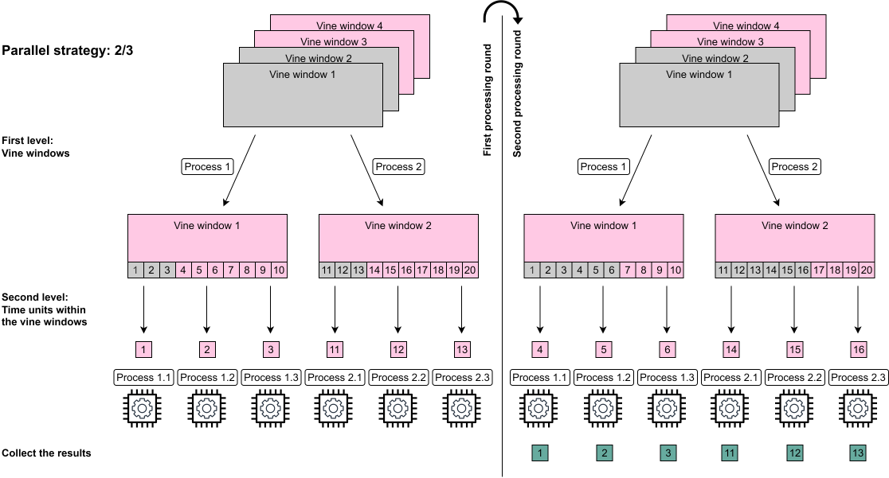
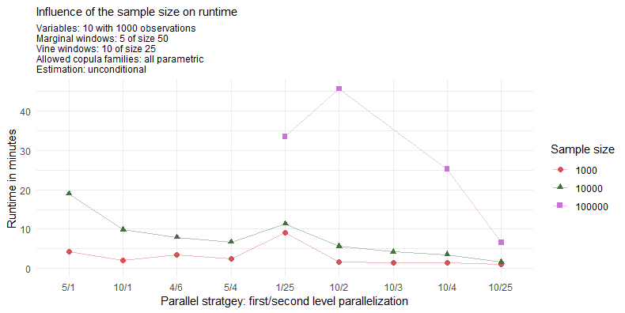
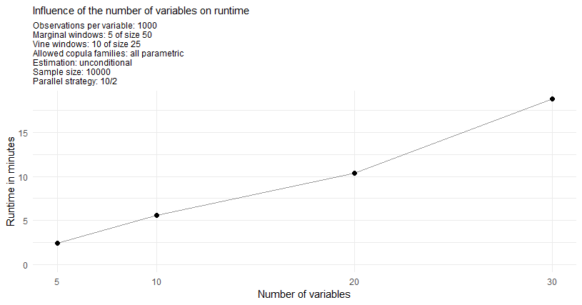
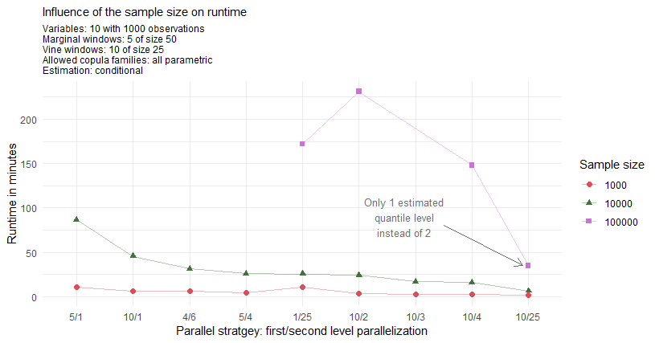
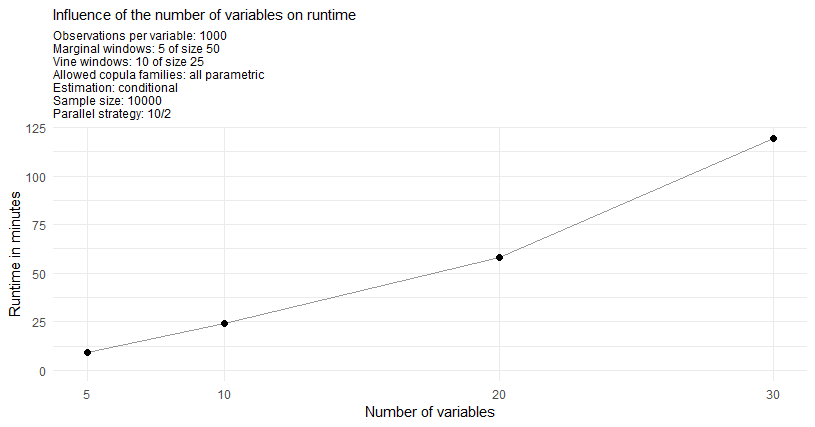

```{r, include = FALSE}
knitr::opts_chunk$set(
  collapse = TRUE,
  comment = "#>"
)
```

This article will first provide a short overview what actually is running in parallel. Then some performance measures of different parallel strategies are presented.

It is recommended to first have a look at the **theoretical vignette** to understand what is actually going on under the hood. A good understanding of the algorithm then allows to choose the right parallel strategy for the specific setting.

## Nested parallel processing

The `portvine` package  allows for **nested parallel processing** i.e.two levels of parallel processes. These levels are the following.

1. The first level allows to fit the univariate time series models for each asset in parallel **and** to fit each vine window in parallel.
2.  The second level allows if specified that within each vine window the time units, often days, are processed using parallel processes.

From here on one will use the notation $p_1$/$p_2$ for the possible parallel strategies where $p_1$ specifies the number of parallel processes/cores on the first level and $p_2$ the number of parallel processes/cores every first level process can in turn call. This means 1/1 is the default sequential case, 5/1 does only use the first level parallelization and 8/2 would require 16 cores as every first level parallel process can use 2 parallel processes while iterating over the time units/days. An illustration of the two first processing rounds of the nested parallelization of the vine windows can be found below.

<br>

<br>
<br>

## Performance measurements

The measurements were performed on a Linux Cluster of the Leibniz Supercomputing Centre.  The provided computational resources are gratefully acknowledged.  The used R version is 3.6.0.

Throughout the measurements one will always estimate the VaR and the ES at two $\alpha$ levels each.

### The unconditional case

<br>

<br>
<br>

Especially for 100000 samples the use of 40 cores with 10/4 instead of 20 cores with 10/2 pays off almost linearly.  The maximum strategy of 10/25 achieves a great runtime of under 7 minutes.  For the reasonable sample size of 10000 one can see that with already 20 cores one can achieve a quite quick runtime of roughly 5 minutes. Also it seems reasonable to assign as many parallel processes as possible up to the number of vine windows to the first level of parallelization and then to assign as many additional processes to the second level of parallelization. This however changes for really large sample sizes where it can be seen that assigning lots of processes to the second level might pay off.  This is evident when looking at the strategy 1/25.

<br>

<br>
<br>


### The conditional case

As the conditional approach performs almost identical for a single or two conditional variables one displays just the performance measures of the single conditional case.  Furthermore one will estimate at the two quantile levels  $\alpha^I$/`cond_u` 5% and 50%.  The conditional risk measure estimation approach is expected to have longer runtimes mostly due to the fact that for each specified quantile level `cond_u` and the additional prior residual risk estimates one has to sample $S$/`n_samples` conditional samples.   For the here specified two quantile levels this means that one samples 3 times as many conditional samples as unconditional samples in the unconditional risk estimation approach.  Moreover the overhead of the conditional estimation is slightly higher.

<br>

<br>
<br>

As annotated on the plot the observation for the maximal strategy 10/25 and sample size  of  100000  corresponds  to  the  estimation  of  only  1  conditional  quantile  as  2  conditional  quantiles would come with the extensive memory requirements of >100Gb.  From this fact one directly expects this estimation  to  be  roughly  33%  faster.   But  even  after  adjusting  for  this  expected  33%  faster  result  one observes a drop of another 44% in runtime for this particular parallel strategy. 

<br>

<br>
<br>

<br>

<br>
<br>

I hope these measurements help a little when choosing an appropriate parallel strategy for your needs.
