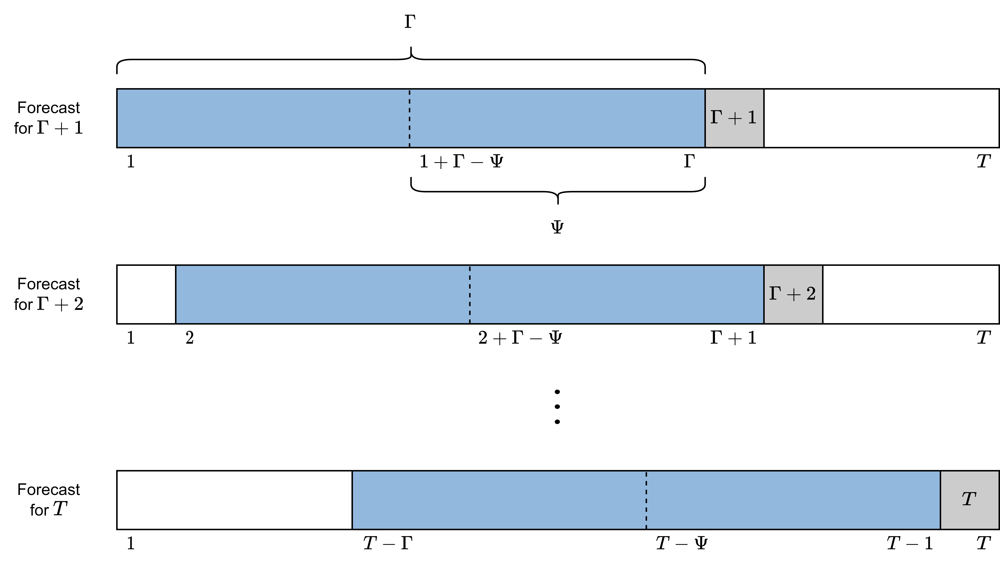
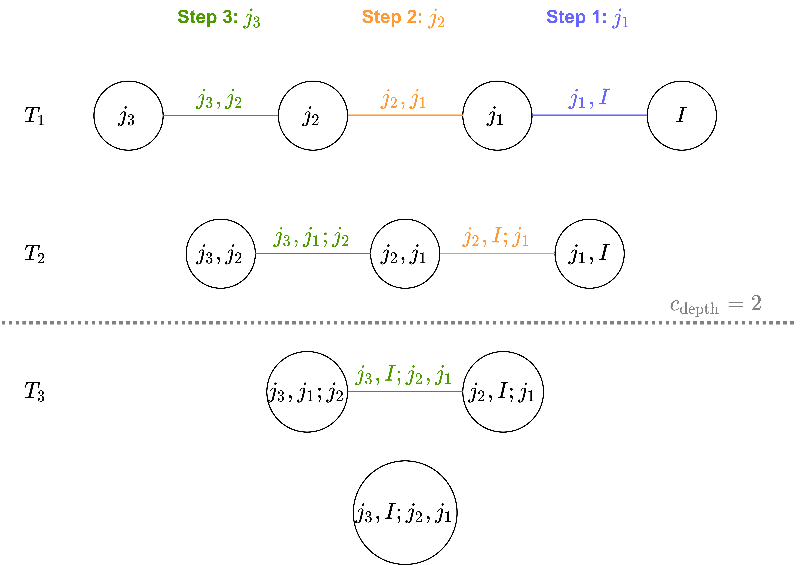

```{r, include = FALSE}
knitr::opts_chunk$set(
  collapse = TRUE,
  comment = "#>"
)
```

This vignette will showcase **what is going on under the hood** of the
`portvine` package. It will not contain any code so for a practical
introduction on how to work with the package have a look at the **Get
Started** vignette. At the end of this vignette one can find a mapping
table from the theoretical notation to the function arguments in the
`portvine` package. Note that this is just a package vignette so for a 
more rigorous and way more detailed explanation of the theory
consult my master thesis that will be linked to here after publishing.

In order to discuss the theory some notation is needed. One has a
portfolio $\Omega$ of $d$ assets $A_j$ with corresponding log returns
$r_t^{A_j}$ for the time frame $t = 1,\dots,T$. Additionally one has a
weight of each asset in the portfolio denoted by $w_j$. So one can write
$\Omega = \{w_j,r_t^{A_j}|t = 1,\dots,T;j=1,\dots,d\}$. Furthermore one
has the hyperparameters

-   $\Gamma < T \in \mathbb{N}$: Length of the fitting window for the
    marginal models. Here one assumes that this is also the time index
    of the most recent asset return observation when starting the
    rolling window approach. So for the first marginal time series model
    one uses all the available historic data.
-   $\Psi \leq \Gamma \in \mathbb{N}$: Length of the fitting window for
    the vine copula model in order to capture dependencies.
-   $S \in \mathbb{N}$: : Number of to be simulated log returns for the
    risk measure estimation.

Despite the final algorithms are performed in a rolling window fashion
it is easier to grasp the one step ahead risk measure estimation which
moves through the data according to the parameters introduced above as
shown below.

<br>

<br> <br>

The detailed **unconditional one step ahead risk measure estimation** is
now shown.

<br>

<br> <br>

This one step approach however requires a huge number of models to be
fit in order to estimate the risk measures for even a smallish interval
of interest like 50 trading days. Thus the rolling window approach with
the following additional parameters is introduced.

-   $\gamma \leq (T-\Gamma) \in \mathbb{N}$: Length of the forecasting
    window of the marginal models.
-   $\kappa \leq \gamma \in \mathbb{N}$: Length of the usage window of
    the vine copula model.

It might be reasonable to pick them such that
$(T-\Gamma) \text{ mod } \gamma \equiv 0$ and one requires
$\gamma \text{ mod } \kappa \equiv 0$. An illustration of the parameters
and the rolling of the respective windows of the rolling window approach
can be found below.

<br>

<br> <br>

The full rolling window algorithm for unconditional risk measure
estimation is stated in my master thesis to which I will link here as
soon as it will be published. Now the **single conditional risk measure
estimation** will be discussed with some additional notation.

-   Market index $I$: that is observed over the same time scale as the
    portfolio $\Omega$, the log returns are again denoted by $r_t^I$.
-   Let $j_1,\dots,j_d$ be a to be determined permutation of the indices
    of the assets $1,\dots,d$.
-   $\alpha^I \in (0,1)$: Confidence level of the estimated quantile
    from the marginal market index distribution. This confidence level
    is the conditioning value for the final risk measure estimate on the
    copula scale. How this fits into the estimation process can be seen
    below.

The approach is actually quite similar and is again illustrated for the
**one step ahead single conditional risk measure estimation**.

<br>

<br> <br>

The ordering of the D-vine is calculated based on Pearson and partial
correlations from the training data and aims to maximize the resulting
full likelihood of the copula. An illustration of the estimated
dependencies that are maximized in each step of the algorithm for a 4
dimensional example is given below.

<br>  <br>
<br>

The $c_{depth}$ parameter can be used to only account for the
dependencies up to the corresponding depth. More details can be once
again found in my master thesis.

Additionally to this approach based on a quantile level one can also use
the copula scale residual of the index $I$ from the prior time unit i.e.
to estimate the risk measure at time unit $t$ use $u^I_{t-1}$ as the
conditioning value at the copula scale. The resulting estimated risk
measure will emulate the behavior of conditioning on the predicted
market index log return series and might be a valuable comparison to the
estimated quantile based conditional risk measures. Opposed to the
**quantile based conditional risk measures** one will can call these
**prior residual conditional risk measures**. These `prior_resid` risk
measure estimates are calculated by default in the conditional case.

Extending the single conditional case to **two conditioning market
indices** $I_1, I_2$ is quite straight forward. The only crucial change
is to determine the conditioning values for the conditional sampling
based on a quantile level $\alpha^I$. This is achieved via the the
bivariate copula fitted between the two market indices to adjust for
their dependence. The ordering algorithm resulting in the order
$A_{j_d}-\dots- A_{j_1}-I_{\tilde{j}_1}-I_{\tilde{j}_2}$ is conceptually
equal to the one for a single market index. A detailed elaboration can
be found in my master thesis. It is also there where the **conditional
sampling algorithms for D-vine copulas based on the rightmost leaf(s)**
were introduced. Moreover the thesis also theoretically elaborates on
applicable backtesting strategies for the resulting portfolio level
Value at Risk and expected shortfall estimates.

Finally a table is given that maps the function arguments to the now
theoretically used variable names.

+----------------------+-----------------------+-----------------------+
| Theoretical          | Function              | Argument              |
+======================+=======================+=======================+
| $\{r^{A_j}_t|t=1,\dot| `                     | `data`                |
| s,T;j = 1,\dots,d\}$ | estimate_risk_roll()` |                       |
|                      |                       |                       |
| and in the           |                       |                       |
| conditional case     |                       |                       |
| also the log returns |                       |                       |
| of the conditioning  |                       |                       |
| assets e.g. $r^I_t$. |                       |                       |
+----------------------+-----------------------+-----------------------+
| $\{w_j|j=1,\dots,d\}$| `                     | `weights`             |
|                      | estimate_risk_roll()` |                       |
+----------------------+-----------------------+-----------------------+
| $\Gamma$             | `marginal_settings()` | `train_size`          |
+----------------------+-----------------------+-----------------------+
| $\gamma$             | `marginal_settings()` | `refit_size`          |
+----------------------+-----------------------+-----------------------+
| $\Psi$               | `vine_settings()`     | `train_size`          |
+----------------------+-----------------------+-----------------------+
| $\kappa$             | `vine_settings()`     | `refit_size`          |
+----------------------+-----------------------+-----------------------+
| $S$                  | `                     | `n_samples`           |
|                      | estimate_risk_roll()` |                       |
+----------------------+-----------------------+-----------------------+
| $\alpha$             | `                     | `alpha`               |
|                      | estimate_risk_roll()` |                       |
+----------------------+-----------------------+-----------------------+
| $\widehat{RM}(\cdot)$| `                     | `risk_measures`       |
|                      | estimate_risk_roll()` |                       |
+----------------------+-----------------------+-----------------------+
| $I$ or $I_1,I_2$     | `                     | `cond_vars`           |
|                      | estimate_risk_roll()` |                       |
+----------------------+-----------------------+-----------------------+
| $\alpha^I$           | `                     | `cond_u`              |
|                      | estimate_risk_roll()` |                       |
+----------------------+-----------------------+-----------------------+
| $c_{depth}$          | `                     | `cutoff_depth`        |
|                      | estimate_risk_roll()` |                       |
+----------------------+-----------------------+-----------------------+
